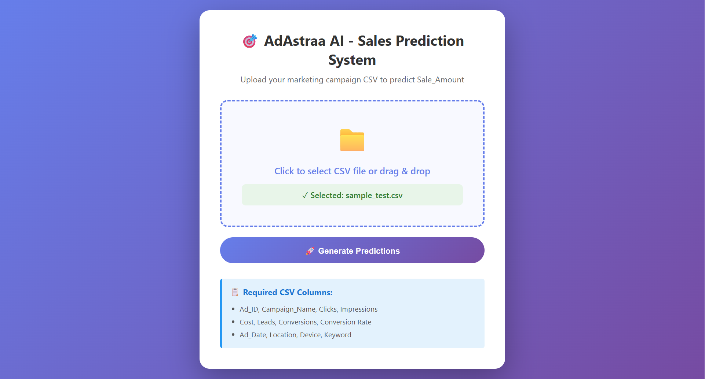

# AdAstraa AI - ML Sales Prediction System

## 🎯 Project Overview

A full-stack Django web application that predicts **Sale_Amount** for marketing campaigns using machine learning. Built for the AdAstraa AI 24-hour technical challenge.


---

## 📊 Data Preprocessing Strategy

### Data Quality Issues Handled

1. **Inconsistent Date Formats**
   - Input: `2024-11-16`, `20-11-2024`, `2024/11/16`
   - Solution: Used `dateutil.parser` for universal date parsing
   - Extracted features: Day, Month, Weekday, Week

2. **Currency Format Variations**
   - Input: `$231.88`, `$195.9`, missing values
   - Solution: Removed `$` symbol, converted to float, filled missing with median

3. **Campaign Name Typos**
   - Input: `DataAnalyticsCourse`, `Data Anlytics Corse`, `Data Analytcis Course`
   - Solution: Standardized all variations to `data analytics course`

4. **Location Variations**
   - Input: `hyderabad`, `HYDERABAD`, `Hyderbad`, `hydrebad`
   - Solution: Normalized to lowercase `hyderabad`

5. **Device Case Inconsistency**
   - Input: `DESKTOP`, `Desktop`, `desktop`, `MOBILE`, `mobile`, `TABLET`
   - Solution: Standardized to lowercase (`desktop`, `mobile`, `tablet`)

6. **Incorrect Conversion Rates**
   - Issue: Some conversion rates don't match Conversions/Clicks
   - Solution: Recalculated as `Conversions / Clicks` and created new feature

7. **Missing Values**
   - Strategy: Median imputation for numeric columns (Clicks, Impressions, Cost, etc.)
   - Frequency: Clicks (4.1%), Impressions (2.2%), Conversion Rate (23.8%)

### Feature Engineering

Created 10 new features to improve model performance:

| Feature | Formula | Business Insight |
|---------|---------|------------------|
| **CTR** | Clicks / Impressions | Ad engagement rate |
| **CPC** | Cost / Clicks | Cost efficiency |
| **Cost_Per_Lead** | Cost / Leads | Lead acquisition cost |
| **Lead_Conversion_Rate** | Conversions / Leads | Lead quality |
| **Revenue_Per_Conversion** | Sale_Amount / Conversions | Conversion value |
| **Day, Month, Weekday** | Extracted from Ad_Date | Temporal patterns |
| **Week** | ISO week number | Seasonal trends |

### Categorical Encoding

Used **LabelEncoder** for:
- Campaign_Name (4 variations)
- Location (4 variations)  
- Device (3 types)
- Keyword (6 variations)

---

## 🤖 Model Development


**Model Selection:**

**Why LightGBM?**  
- Best test performance (lowest MAE)  
- Handles messy data and outliers robustly  
- Captures complex feature interactions automatically  


## 🖼️ Output Screenshot

Here is the sample output of the predictions from the application:



## 🚀 Installation & Setup


### Step 1: Clone Repository
```bash
git clone https://github.com/yourusername/adastraa-ml-challenge.git
cd adastraa-ml-challenge
```

### Step 2: Create Virtual Environment
```bash
python -m venv venv

# Windows
venv\Scripts\activate

# Mac/Linux
source venv/bin/activate
```

### Step 3: Install Dependencies
```bash
pip install -r requirements.txt
```


### Step 4: Run Development Server
```bash
python manage.py runserver
```

Visit: http://127.0.0.1:8000/

---


## 🧪 Testing the Application

### Method 1: Web Interface

1. Start server: `python manage.py runserver`
2. Open browser: `http://127.0.0.1:8000/`
3. Upload `sample_test.csv`
4. Download `predictions.csv`


## 🔍 Error Handling

### Input Validation
- ✅ File type check (must be `.csv`)
- ✅ Required columns validation
- ✅ Data type compatibility

### Preprocessing Errors
- ✅ Handles missing values gracefully
- ✅ Unseen categorical values mapped to -1
- ✅ Invalid dates handled with fallback

### Model Errors
- ✅ Inf/NaN values replaced before prediction
- ✅ Detailed error messages returned to user
- ✅ Full traceback logged for debugging

--
## 🎯 Assumptions & Limitations

### Assumptions

1. **Data Distribution**: Test data follows similar patterns as training data
2. **Feature Relevance**: All 12 columns contribute meaningfully
3. **Temporal Stability**: Campaign performance patterns remain consistent
4. **Missing Mechanism**: Data missing at random (MAR)


## 🚀 Production Improvements

### With More Time 

1. **Advanced Feature Engineering** (2-3 hours)
   - Interaction features (Device × CTR, Location × Cost)
   - Polynomial features for non-linear relationships
   - Time-series features (rolling averages, lag features)

2. **Hyperparameter Tuning** (3-4 hours)
   - Optuna/GridSearchCV for optimal parameters
   - Feature selection (Recursive Feature Elimination)
   - Ensemble methods (stacking multiple models)

3. **Better Validation** (1-2 hours)
   - Stratified K-Fold by Campaign_Name
   - Time-series split (train on past, test on future)
   - Learning curves analysis

4. **UI Enhancements** (2-3 hours)
   - Feature importance visualization
   - Prediction confidence intervals
   - Real-time data quality metrics

### Scaling to Production

#### Architecture
```
┌─────────────┐      ┌──────────────┐      ┌─────────────┐
│   Nginx     │─────▶│  Gunicorn    │─────▶│   Django    │
│ (Load Bal.) │      │  (WSGI)      │      │   App       │
└─────────────┘      └──────────────┘      └─────────────┘
                                                    │
                                                    ▼
                                            ┌─────────────┐
                                            │   Redis     │
                                            │   (Cache)   │
                                            └─────────────┘
```

#### Key Components

1. **API Gateway**: RESTful API with authentication
2. **Model Versioning**: MLflow for experiment tracking
3. **CI/CD**: GitHub Actions for automated testing/deployment

#### Deployment Checklist

- [ ] Containerize with Docker
- [ ] PostgreSQL instead of SQLite
- [ ] Redis for caching predictions
- [ ] Celery for async processing (large files)
- [ ] Model A/B testing framework
- [ ] Prediction drift monitoring
- [ ] Auto-scaling on AWS/GCP
- [ ] Backup and disaster recovery

---

---

## 🙏 Acknowledgments

- **AdAstraa AI** for the engaging technical challenge
- **scikit-learn** and **Django** communities for excellent documentation

